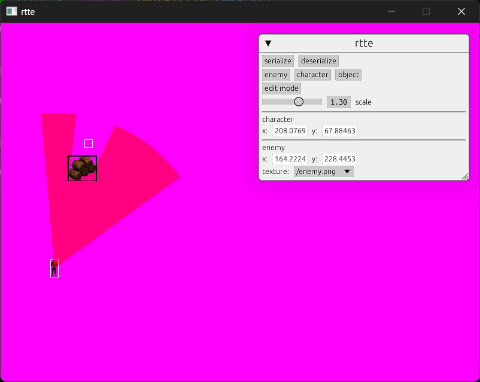

# RTTE
RTTE is attempt to create 2D isometric real time tactics game engine similar to Commandos or Desperados.



## Disclaimer
I'm not game developer nor Rust developer.

## Goals
- mission editor
- small codebase
- human readable mission files
- online cooperation
- ...

## Build
```cargo build```

## Run
```cargo run```
